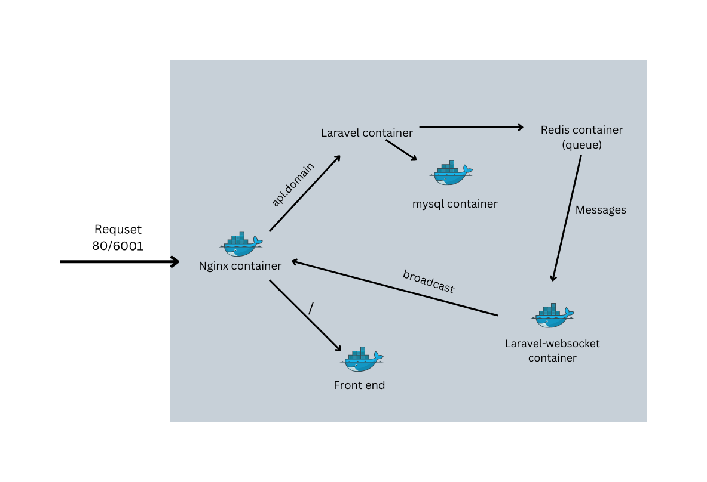
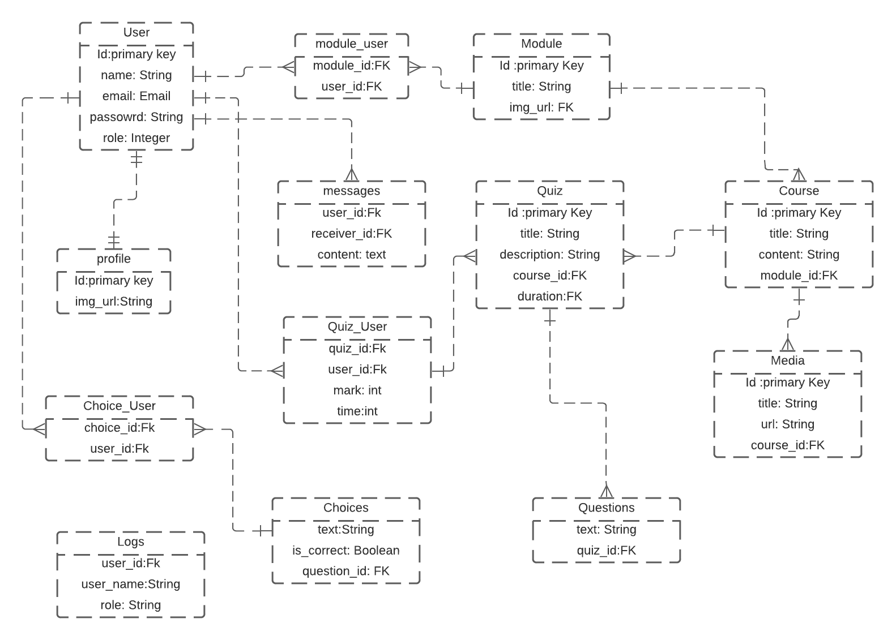
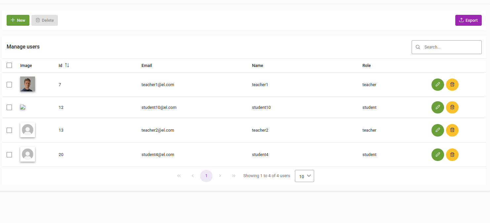
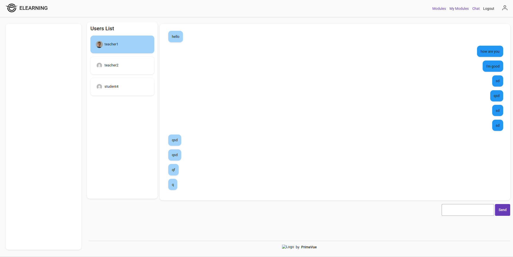
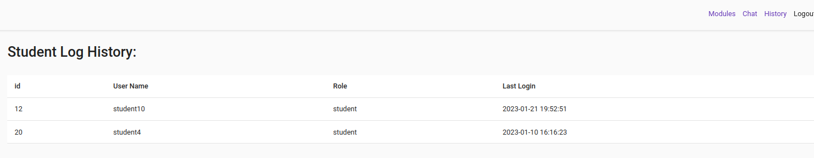
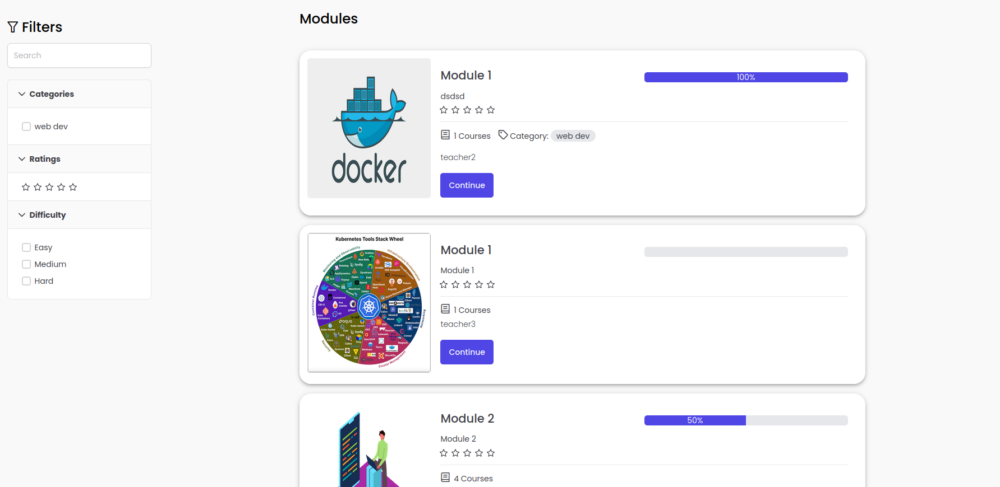
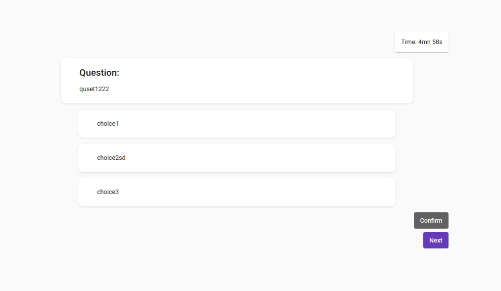
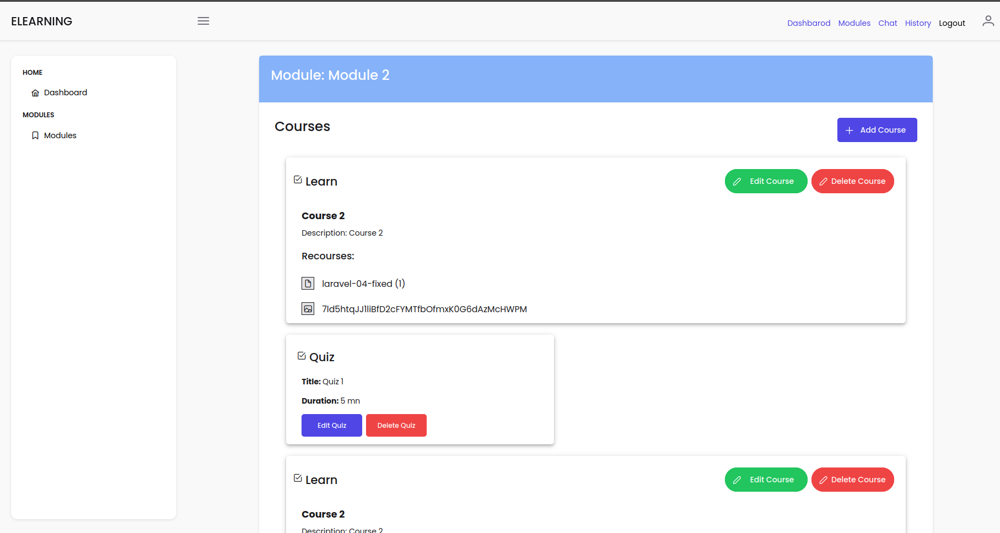
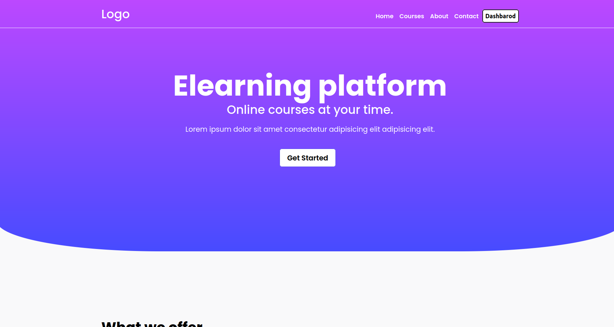
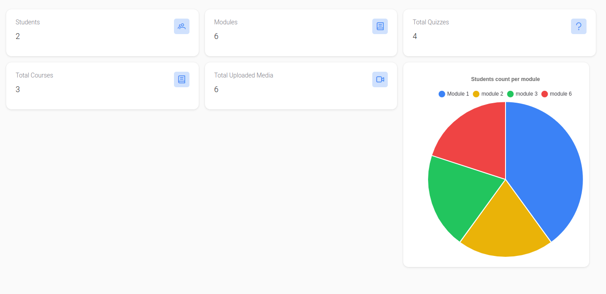

# Elearning-app-api
A simple e-learning platform made with laravel and vue.js.

## Features:
The app is contains three types of users:
### 1. **Admin** 
    + Crud operations on users
    + Dashboard containing simple stats
    + History log for the users 

### 2. **Teacher** 
    + Add Modules
    + Add Courses for each module
    + Add quizzes for each course
    + attach media(text,vedio) to courses
    + Dashboard containing simple stats
    + History log for the students
     
### 3. **Student**  
    + View All modules
    + entroll to modules
    + take courses (vedio,text)
    + take quizzzes

### 4. **General Features** 
    + A chat section where diffrent user can talk to each other.

## Technologies used:
   + Laravel for the api
   + Larave websockets pakcage for the websockes server
   + Laravel Spatie package for role and permission managements.
   + Redis for messages event queue
   + Docker for managing the containers
   + Nginx as a web server

  
## Back end Aritechure  

## Enity-Association Diagram  

## Screenshots

Admin users             |  Chat
:-------------------------:|:-------------------------:
  |  

Student history            |  Modules
:-------------------------:|:-------------------------:
  |  

Quiz                       |     Teacher courses        
:-------------------------:|:-------------------------:
  |  

Home

