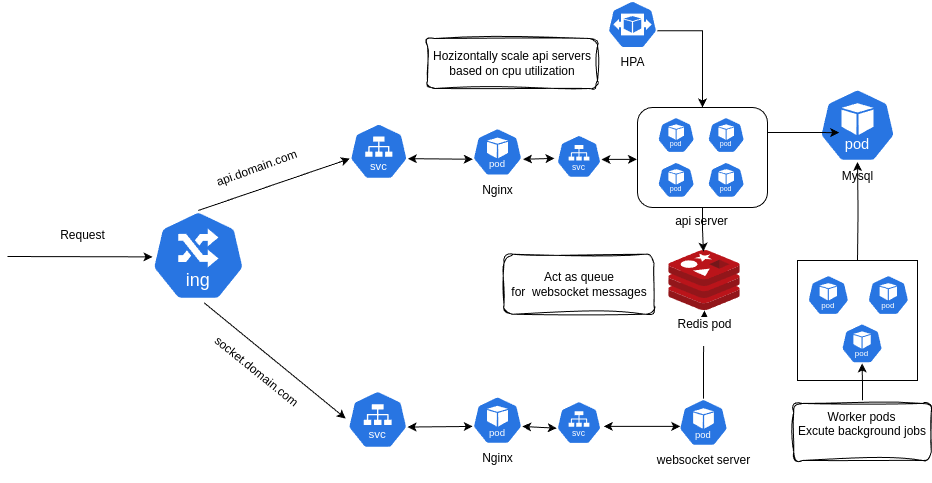

# Elearning-app-api
A simple E learning platform made with laravel and vue.js.

## Features:
The application  contains three types of users:
# 1. **Admin** 
    + Crud operations on users
    + Dashboard containing simple stats
    + History log for the users 

# 2. **Teacher** 
    + Add Modules
    + Add Courses for each module
    + Add quizzes for each course
    + Attach media(text,video) to courses
    + Dashboard containing simple stats
    + History log for the students
     
# 3. **Student**  
    + View All modules
    + Enroll to modules
    + Take courses (video,text)
    + Take quizzes

# 4. **General Features** 
    + A chat section where different users can talk to each other.

# 5. **Technologies used**:
    + Laravel for the api.
    + Laravel Reverb p for the websoket server.
    + Laravel Spatie package for role and permission managements.
    + Redis for messages event queue.
    + Docker for managing the containers.
    + Nginx as a web server.
    + kubernetes.
## Back end Architecture  (Kubernetes version)

## Back end Architecture  (compose version)

## Enity-Association Diagram  

## Screenshots

### Modules

### Teacher courses       

### Chat

### Admin users               

    
### Student history            

    

### Quiz                      

   

### Home

### Stats 

